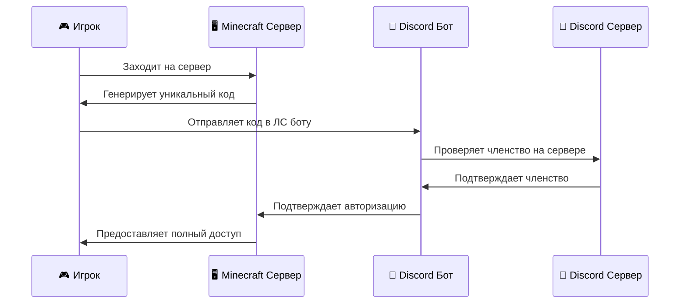

<div align="center">

# 🛡️ AuthDiscord

### Безопасная авторизация для Minecraft через Discord

[]()
[]()
[]()
[](https://discord.com)

[🚀 Установка](#-установка) • [⚙️ Настройка](#️-настройка) • [📖 Команды](#-команды) • [❓ FAQ](#-faq)

---

</div>

## 📝 Описание

**AuthDiscord** — инновационный плагин авторизации для Minecraft серверов, обеспечивающий интеграцию с Discord. Плагин добавляет дополнительный уровень безопасности, требуя от игроков подтверждения личности через Discord бота перед получением полного доступа к серверу.

## ✨ Основные возможности

<table>
<tr>
<td width="50%">

### 🔐 Безопасность
- **Двухфакторная аутентификация** через Discord
- **Уникальные временные коды** для каждой сессии
- **Проверка членства** в Discord сервере
- **Блокировка действий** для неавторизованных игроков

</td>
<td width="50%">

### 🎮 Функциональность
- **Отображение Discord тегов** в игре
- **SQLite база данных** для хранения привязок
- **Административные команды** управления
- **Настраиваемые сообщения** и таймауты

</td>
</tr>
</table>

## 🔄 Как это работает



## 📋 Требования

| Компонент | Минимальная версия |
|-----------|-------------------|
| 🖥️ **Minecraft сервер** | Paper/Spigot 1.20+ |
| ☕ **Java** | 21+ |
| 🤖 **Discord бот** | Токен и права доступа |
| 💾 **Свободное место** | ~5 МБ |

## 🚀 Установка

### Шаг 1: Создание Discord бота

<details>
<summary>📱 Развернуть инструкцию</summary>

1. Перейдите на [Discord Developer Portal](https://discord.com/developers/applications)
2. Нажмите **"New Application"** и введите название
3. Перейдите в раздел **"Bot"**
4. Нажмите **"Add Bot"**
5. Скопируйте **Bot Token** (храните в секрете!)
6. Включите **"Message Content Intent"**

</details>

### Шаг 2: Установка плагина

```bash
# Скачайте плагин и поместите в папку plugins
cd /path/to/your/server
wget https://github.com/yourrepo/authdiscord/releases/download/v1.0.0/authdiscord-1.0.0.jar
mv authdiscord-1.0.0.jar plugins/
```

### Шаг 3: Первый запуск

```bash
# Запустите сервер для создания конфигурационных файлов
./start.sh
# или
java -jar server.jar
```

## ⚙️ Настройка

Отредактируйте файл `plugins/AuthDiscord/config.yml`:

```yaml
# 🤖 Настройки Discord бота
bot_token: "YOUR_BOT_TOKEN_HERE"
guild_id: "123456789012345678"

# ⚡ Настройки кодов
code_length: 8           # Длина кода (4-12)
code_timeout: 5          # Время жизни кода в минутах

# 💬 Сообщения (опционально)
messages:
  auth_required: "§eДля авторизации напишите этот код боту в Discord: §b%code%"
  auth_success: "§aВы успешно авторизованы как §b%tag%"
  auth_frozen: "§cВы должны авторизоваться через Discord!"
  not_in_guild: "❌ Вы не состоите в нужном Discord-сервере."
  auth_complete: "✅ Привязка выполнена! Теперь вы можете играть."
  invalid_code: "❌ Неверный код авторизации."
  unlink_success: "§aПривязка игрока %player% была удалена."
  player_not_found: "§cИгрок не найден."
  config_reloaded: "§aКонфигурация перезагружена."
```

### Добавление бота на сервер

Используйте следующую ссылку, заменив `YOUR_BOT_ID`:

```
https://discord.com/oauth2/authorize?client_id=YOUR_BOT_ID&scope=bot&permissions=67584
```

## 📖 Команды

| Команда | Описание | Права доступа |
|---------|----------|---------------|
| `/unlink <игрок>` | Удалить привязку игрока | `authdiscord.admin` |
| `/reloadauth` | Перезагрузить конфигурацию | `authdiscord.admin` |
| `/authstats` | Статистика авторизаций | `authdiscord.admin` |

## 🔑 Права доступа

- `authdiscord.admin` — Полные права администратора (по умолчанию для OP)
- `authdiscord.bypass` — Обход авторизации (для модераторов)

## ❓ FAQ

<details>
<summary><strong>🤔 Игрок не может авторизоваться</strong></summary>

1. Проверьте, что игрок состоит в вашем Discord сервере
2. Убедитесь, что бот онлайн и имеет необходимые права
3. Проверьте правильность токена бота в конфиге

</details>

<details>
<summary><strong>⚠️ Бот не отвечает на команды</strong></summary>

1. Проверьте включен ли "Message Content Intent"
2. Убедитесь, что бот добавлен на сервер с правильными правами
3. Проверьте логи сервера на ошибки

</details>

<details>
<summary><strong>🔄 Как сбросить все привязки?</strong></summary>

Удалите файл `plugins/AuthDiscord/database.db` и перезапустите сервер.

</details>


## 📈 Статистика

- 🎮 **Поддерживаемые версии**: Minecraft 1.20+
- 💾 **Размер базы данных**: ~1KB на 1000 игроков
- ⚡ **Время авторизации**: ~2-5 секунд
- 🔒 **Уровень безопасности**: Высокий


## 📜 Лицензия

Этот проект распространяется под лицензией **MIT**. Подробности в файле [LICENSE](LICENSE).

---

<div align="center">

**Сделано с ❤️ для Minecraft сообщества**

[](https://github.com/yourrepo/authdiscord/stargazers)
[](https://github.com/yourusername)

**Спасибо за использование AuthDiscord!** 🙏

</div>
